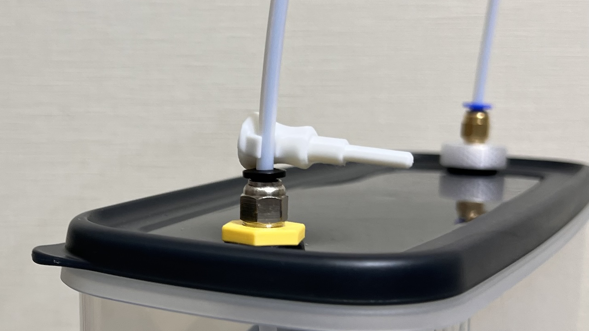

# Clippable PTFE Fitting Plug

|File Name|Description|
|-|-|
|PTFEFittingPlug.stp||

<a property="dct:title" rel="cc:attributionURL" href="https://github.com/Taro-Hayashi/Misc-3D/">Clippable PTFE Fitting Plug</a> by <a rel="cc:attributionURL dct:creator" property="cc:attributionName" href="https://x.com/w_vwbw">Taro Hayashi</a> is licensed under <a href="https://creativecommons.org/licenses/by/4.0/?ref=chooser-v1" target="_blank" rel="license noopener noreferrer" style="display:inline-block;">CC BY 4.0</a>

