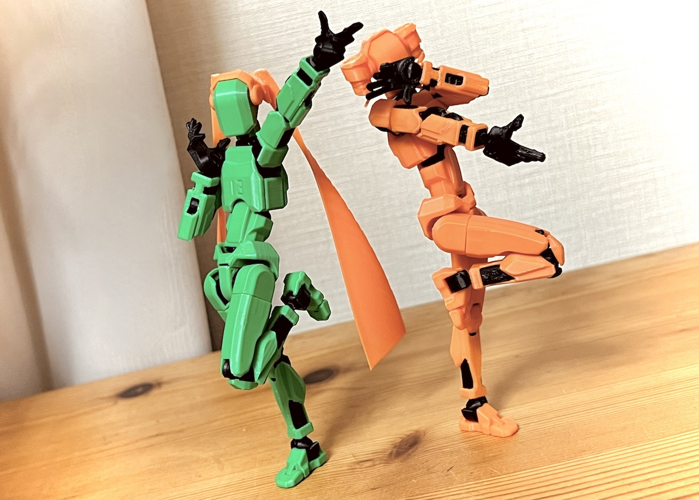
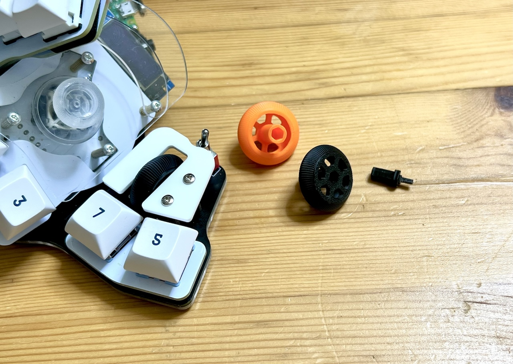
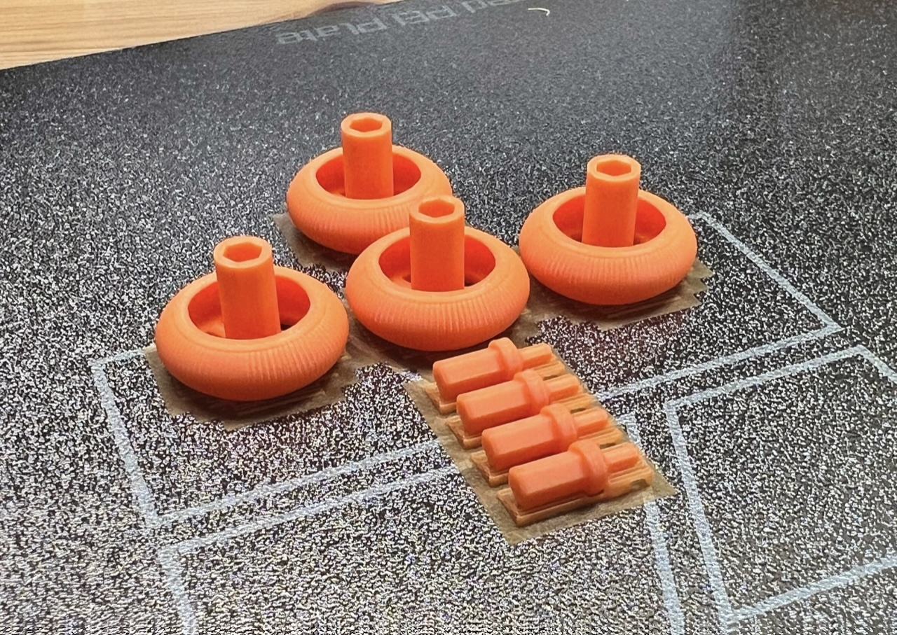

# Misc-3D

## Miku & Teto hair for DUMMY13

### STL
- Printables https://www.printables.com/model/957618-miku-teto-hair-for-dummy13
- Maker World https://makerworld.com/en/models/562477

<a property="dct:title" rel="cc:attributionURL" href="https://github.com/Taro-Hayashi/THQWGD001">Wheel for Killer Whale</a> by <a rel="cc:attributionURL dct:creator" property="cc:attributionName" href="https://x.com/w_vwbw">Taro Hayashi</a> is licensed under <a href="https://creativecommons.org/licenses/by/4.0/?ref=chooser-v1" target="_blank" rel="license noopener noreferrer" style="display:inline-block;">CC BY 4.0</a>

## Wheel for Killer Whale

### STL
- Printables https://www.printables.com/model/949831-mouse-wheel
- Maker World https://makerworld.com/en/models/550322#profileId-468657

<a property="dct:title" rel="cc:attributionURL" href="https://github.com/Taro-Hayashi/THQWGD001">Wheel for Killer Whale</a> by <a rel="cc:attributionURL dct:creator" property="cc:attributionName" href="https://x.com/w_vwbw">Taro Hayashi</a> is licensed under <a href="https://creativecommons.org/licenses/by/4.0/?ref=chooser-v1" target="_blank" rel="license noopener noreferrer" style="display:inline-block;">CC BY 4.0</a>

### Required
||||
|-|-|-|
|Shaft|1|killer_whale_shaft_v1.stl|
|Wheel|1|killer_whale_wheel_v1.stl|
|Wheel Encoder|1|11mm|
|M2 screws|3|
|M2 Spacer|1|8mm|
|M2 Spacers|2|D = 3.3, H = more than 12mm|

### KiCad footprint

- https://github.com/Taro-Hayashi/THQWGD001/tree/main/KiCad

