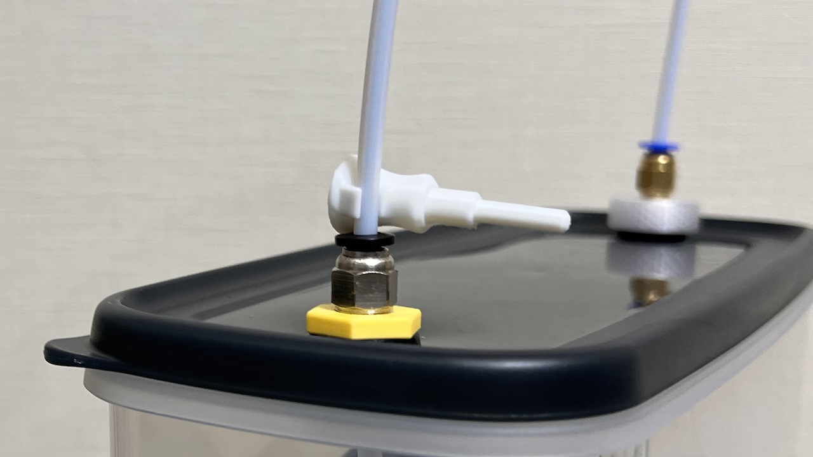
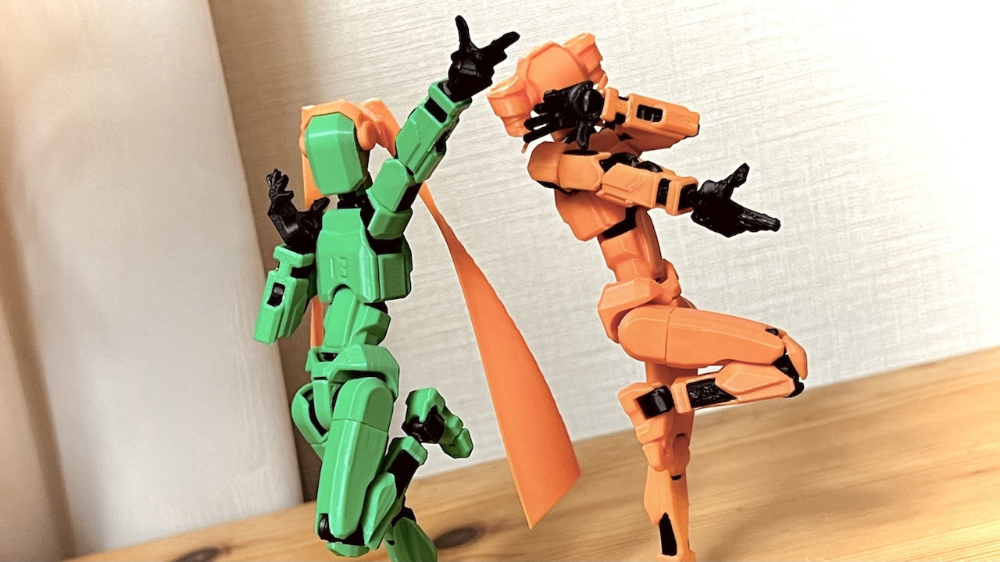
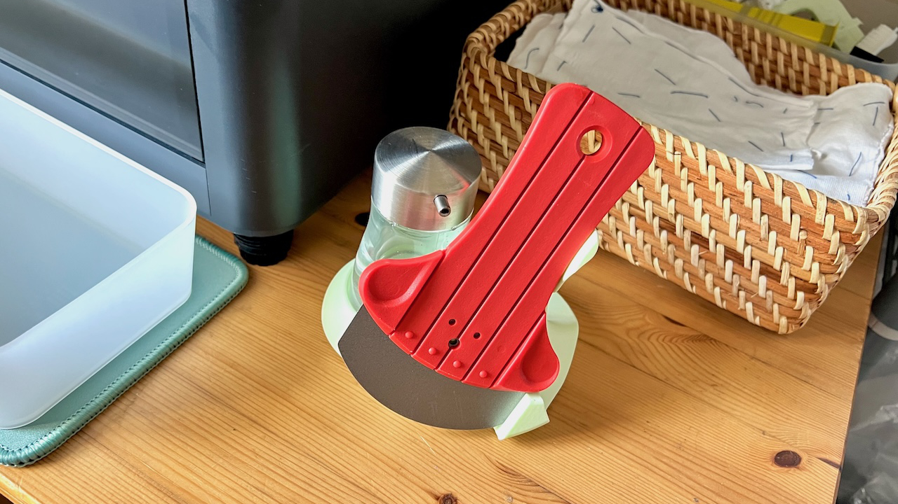

# Misc-3D

## Clippable PTFE Fitting Plug
- Maker World https://makerworld.com/en/models/779136
- Printables https://www.printables.com/model/1070261-clippable-ptfe-fitting-plug
- GitHub https://github.com/Taro-Hayashi/Misc-3D/tree/main/PTFEFittingPlug

<a property="dct:title" rel="cc:attributionURL" href="https://github.com/Taro-Hayashi/Misc-3D/">Clippable PTFE Fitting Plug</a> by <a rel="cc:attributionURL dct:creator" property="cc:attributionName" href="https://x.com/w_vwbw">Taro Hayashi</a> is licensed under <a href="https://creativecommons.org/licenses/by/4.0/?ref=chooser-v1" target="_blank" rel="license noopener noreferrer" style="display:inline-block;">CC BY 4.0</a>

## Miku & Teto hair for DUMMY13
- Maker World https://makerworld.com/en/models/562477
- Printables https://www.printables.com/model/957618-miku-teto-hair-for-dummy13
- GitHub https://github.com/Taro-Hayashi/Misc-3D/tree/main/MikuTetoHair

<a property="dct:title" rel="cc:attributionURL" href="https://github.com/Taro-Hayashi/Misc-3D/">Miku & Teto hair for DUMMY13</a> by <a rel="cc:attributionURL dct:creator" property="cc:attributionName" href="https://x.com/w_vwbw">Taro Hayashi</a> is licensed under <a href="https://creativecommons.org/licenses/by/4.0/?ref=chooser-v1" target="_blank" rel="license noopener noreferrer" style="display:inline-block;">CC BY 4.0</a>

## Scraper Holder
- GitHub https://github.com/Taro-Hayashi/Misc-3D/tree/main/ScraperHolder

<a property="dct:title" rel="cc:attributionURL" href="https://github.com/Taro-Hayashi/Misc-3D/">Scraper Holder</a> by <a rel="cc:attributionURL dct:creator" property="cc:attributionName" href="https://x.com/w_vwbw">Taro Hayashi</a> is licensed under <a href="https://creativecommons.org/licenses/by/4.0/?ref=chooser-v1" target="_blank" rel="license noopener noreferrer" style="display:inline-block;">CC BY 4.0</a>

### Others
Keyboard related models can be found here
- https://github.com/Taro-Hayashi/Keyboard-3D
